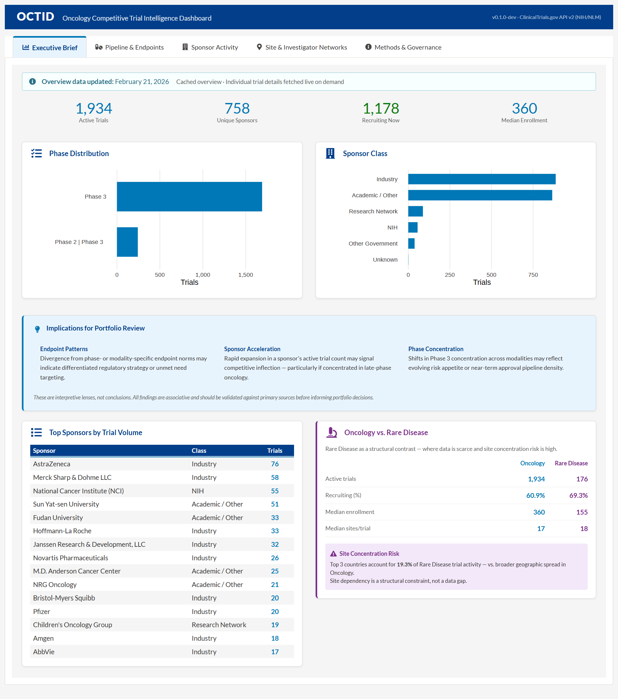
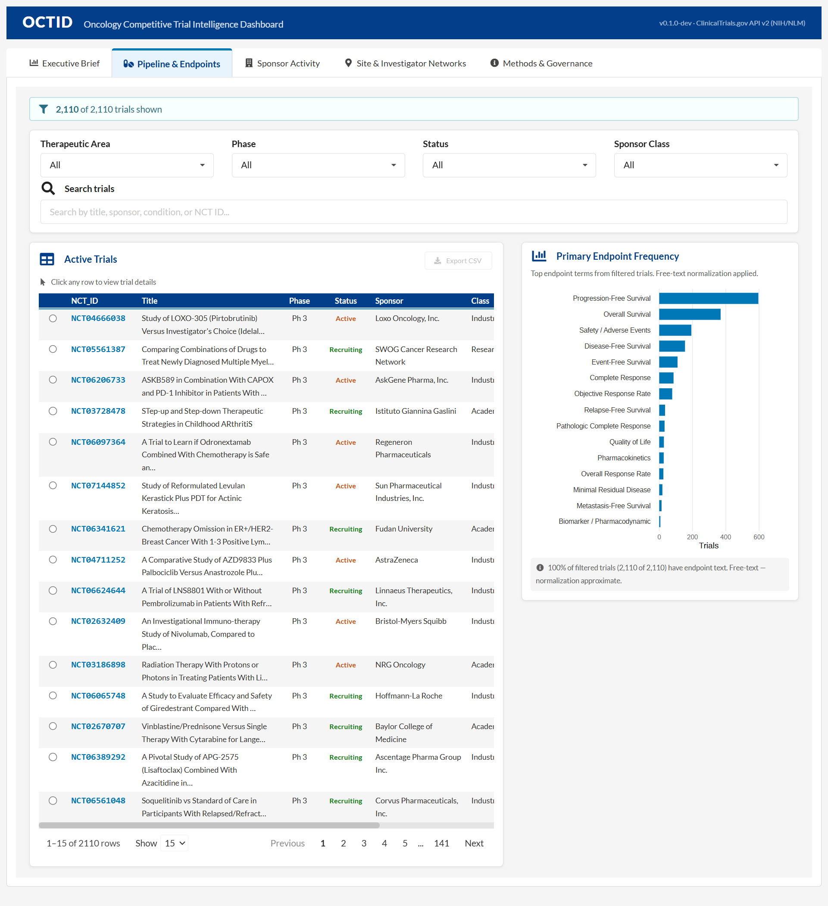
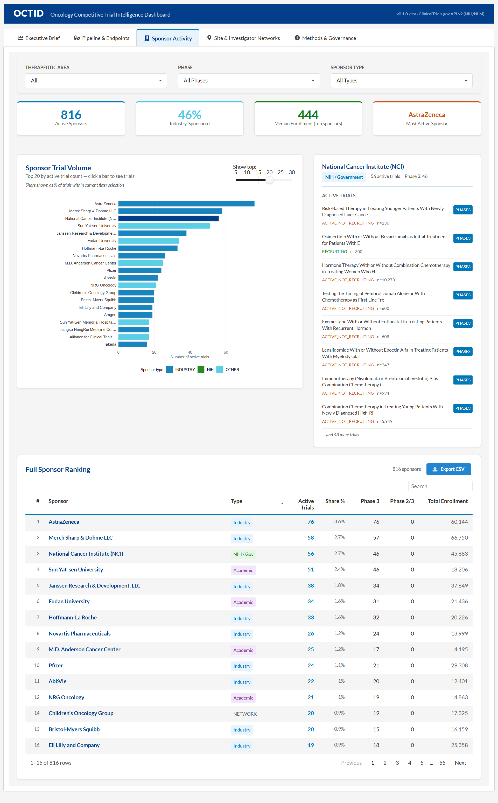
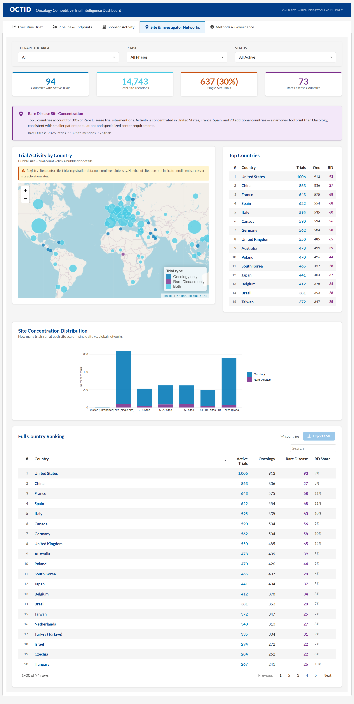
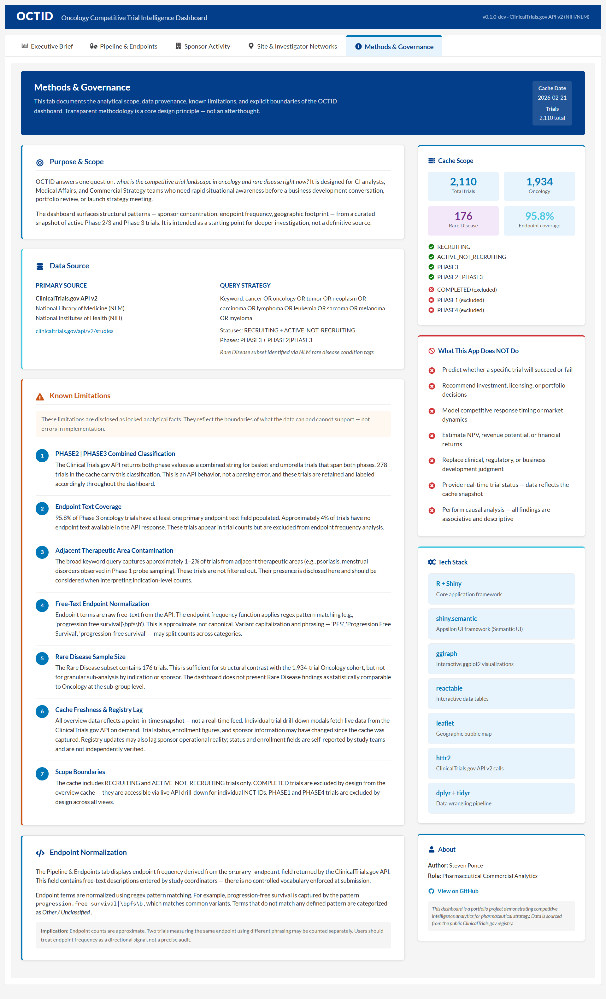

# OCTID: Oncology Competitive Trial Intelligence Dashboard

    

**Oncology competitive trial intelligence — governance-aware and built for structured portfolio decision support.**

---

## Overview

OCTID is a competitive intelligence dashboard consuming the ClinicalTrials.gov API v2 to surface structural patterns in the active oncology trial landscape. It is a **benchmarking tool, not a forecasting engine**.

Designed to surface structural comparators — not tactical trial-level evaluation.

This tool supports oncology portfolio design discussions by surfacing comparative trial design patterns across sponsors and phases — connecting landscape data to decision moments before portfolio reviews, launch strategy meetings, and business development conversations.

**What it answers:**

- Where is trial activity concentrating by phase and modality?
- How do primary endpoints differ across sponsors?
- Who is accelerating pipeline activity?
- Where is enrollment concentrating geographically?

**What it does NOT do:**

- Predict trial success or failure
- Rank or score assets for investment
- Make treatment recommendations
- Estimate NPV or financial returns

---

## Live Dashboard

🔗 **Interactive dashboard (ShinyApps.io):**\
[OCTID — Oncology Competitive Trial Intelligence Dashboard](https://0l6jpd-steven-ponce.shinyapps.io/octid/)

---

## Dashboard Preview

### Executive Brief

\
*KPI summary, phase distribution, sponsor class breakdown, and Oncology vs. Rare Disease structural contrast. Includes an Implications for Portfolio Review panel translating structural patterns into decision context.*

### Pipeline & Endpoints

\
*Primary endpoint frequency analysis across the active oncology trial landscape. Endpoint mapping uses keyword-based normalization — results are directional signals, not canonical audits.*

### Sponsor Activity

\
*Top sponsors by active trial volume with industry vs. academic split. Sponsor share reflects % of trials within the filtered cache scope. Click any bar to see sponsor-level trial details.*

### Site & Investigator Networks

\
*Geographic trial footprint by country. Bubble size reflects trial count. Registry site counts reflect registration data, not enrollment intensity or site activation rates.*

### Methods & Governance

\
*Analytical scope, data provenance, known limitations, endpoint normalization methodology, and explicit scope boundaries. Transparent methodology is a core design principle — not an afterthought.*

---

## Purpose (and Boundaries)

OCTID is designed for CI analysts, Medical Affairs, and Commercial Strategy teams who need rapid situational awareness before a business development conversation, portfolio review, or launch strategy meeting.

**Clear use cases:**
- Are we aligned on endpoint convention for our therapeutic area?
- Is our trial design out of pattern with the competitive landscape?
- Is a key competitor accelerating Phase 3 activity?
- Where is enrollment geographically concentrated?

**Explicit scope boundaries:**
- Does not predict whether a specific trial will succeed or fail
- Does not recommend investment, licensing, or portfolio decisions
- Does not model competitive response timing or market dynamics
- Does not estimate NPV, revenue potential, or financial returns
- Does not replace clinical, regulatory, or business development judgment
- Does not perform causal analysis — all findings are associative and descriptive

---

## Data Architecture

### Hybrid Cache Model

| Layer | Source | Refresh |
|---|---|---|
| Overview cache | GitHub Release asset | Daily via GitHub Actions |
| Trial detail | ClinicalTrials.gov API v2 (live) | On-demand per NCT ID |

The app downloads a fresh cache at startup if the remote version is newer than the bundled fallback. If GitHub is unreachable, it falls back to the bundled snapshot silently — the app always loads.

### Cache Scope (February 2026 snapshot)

All metrics reflect the filtered active Phase 2/3 oncology snapshot as of the cache date.

| Metric | Value |
|---|---|
| Total trials | 2,110 |
| Oncology | 1,934 |
| Rare Disease | 176 (sensitivity lens) |
| Endpoint coverage | 95.8% |
| Statuses | RECRUITING + ACTIVE_NOT_RECRUITING |
| Phases | PHASE3 + PHASE2\|PHASE3 |

**Rare Disease inclusion:** Rare Disease trials (n=176) are included as a sensitivity lens to assess whether benchmark patterns shift under low-prevalence enrollment dynamics. Rare Disease and Oncology data are segmented throughout the dashboard.

---

## Known Limitations

1. **PHASE2\|PHASE3 combined classification** — API behavior, not a parsing error. 278 trials carry this label and are retained accordingly.
2. **Endpoint text coverage** — 95.8% of Phase 3 oncology trials have endpoint text. ~4% are excluded from endpoint frequency analysis.
3. **Adjacent TA contamination** — broad keyword query captures ~1–2% of trials from adjacent areas. Disclosed and not filtered.
4. **Endpoint normalization** — regex-based, approximate. Does not capture composite endpoint definitions, hierarchical testing strategies, or protocol amendment changes.
5. **Rare Disease sample size** — 176 trials. Sufficient for structural contrast, not for granular sub-analysis.
6. **Cache freshness & registry lag** — overview data reflects a point-in-time snapshot. Registry updates may lag sponsor operational reality; status and enrollment fields are self-reported.
7. **Scope boundaries** — COMPLETED, PHASE1, and PHASE4 trials excluded by design.

---

## Tech Stack

| Component | Technology |
|---|---|
| Language | R |
| Framework | Shiny (modular architecture) |
| UI components | shiny.semantic (Appsilon) |
| Visualization | ggplot2, ggiraph |
| Tables | reactable |
| Maps | leaflet |
| API client | httr2 |
| Cache automation | GitHub Actions |
| Deployment | shinyapps.io |

---

## Repository Structure

```
oncology-trial-intelligence/
├── app/
│   ├── app.R                    # Entry point — sources all modules explicitly
│   ├── global.R                 # Packages, cache loading, colors, helpers
│   ├── ui.R                     # Main UI (sources after global.R)
│   ├── server.R                 # Module wiring
│   ├── DESCRIPTION              # Package dependencies for shinyapps.io
│   ├── .rscignore               # Deployment exclusions
│   ├── modules/
│   │   ├── mod_executive_brief.R
│   │   ├── mod_pipeline_endpoints.R
│   │   ├── mod_sponsor_activity.R
│   │   ├── mod_site_networks.R
│   │   └── mod_methods.R
│   ├── data/
│   │   └── processed/
│   │       ├── cache_overview.rds   # Bundled fallback cache
│   │       └── cache_meta.json      # Cache metadata (date, counts)
│   └── www/
│       └── styles.css
├── data-pipeline/
│   └── refresh_cache.R          # GitHub Actions cache builder
├── .github/
│   └── workflows/
│       └── refresh_cache.yml    # Daily cache refresh (02:00 UTC)
└── screenshots/
```

---

## Design Principles

- **Governance-first** — cache scope locked before examining outcomes
- **Overclaim avoidance** — no predictive claims from registry metadata
- **Transparent methodology** — limitations documented as first-class content
- **Multi-persona tabs** — Executive Brief separated from analytical detail
- **Hybrid cache model** — overview cached for performance, detail fetched live
- **Designed to inform judgment, not replace it**

---

## Portfolio Context

Part of a pharmaceutical commercial analytics portfolio demonstrating trial analytics and competitive intelligence capabilities. Complements:

| App | Strategic Function |
|---|---|
| [Launch Curve Forecaster](https://github.com/poncest/launch-curve-forecaster) | Revenue-at-risk & launch timing |
| [Clinical Trial Forecaster](https://github.com/poncest/clinical-trial-forecaster) | Duration uncertainty & validation strategy |
| [Pharma R&D Pipeline Simulator](https://github.com/poncest/pharma-rd-pipeline) | Portfolio exposure & trade-off analysis |
| **OCTID** | **Competitive design intelligence** |

Together, these projects demonstrate a coherent Trial Analytics & Competitive Intelligence portfolio.

---

## License

Released under the **MIT License**.

---

## Disclaimer

Portfolio project using publicly available data from the ClinicalTrials.gov registry (NIH/NLM). Not for commercial use. Not affiliated with any pharmaceutical company or clinical research organization.

All findings are associative and descriptive. No causal claims are made. Results should be validated against primary sources before informing portfolio or clinical decisions.

---

## Contact

**Steven Ponce**\
Data Analyst · R Shiny Developer · Pharmaceutical Analytics

🔗 **Portfolio**: [stevenponce.netlify.app](https://stevenponce.netlify.app/projects.html)\
🐙 **GitHub**: [@poncest](https://github.com/poncest)\
💼 **LinkedIn**: [stevenponce](https://www.linkedin.com/in/stevenponce/)\
🦋 **Bluesky**: [@sponce1](https://bsky.app/profile/sponce1.bsky.social)

---

*Prepared by Steven Ponce as part of a professional analytics portfolio.*\
*Demonstrating competitive intelligence design, governance discipline, and modular Shiny architecture.*

**Version:** 1.0.0\
**Last updated:** February 2026